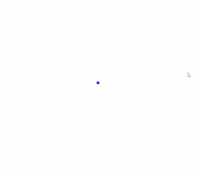

# LinqSTG

**LinqSTG** is a .NET library providing LINQ-like functional operations for sequence patterns of time-based shooting events that can be used for creating/analyzing danmaku patterns. It allows you to compose, transform, and filter instances with high-level, chainable APIs similar to LINQ, with support for interval-based temporal logic.



## Features

- Functional projection and transformation (`Select`, `SelectMany`)
- Filtering and condition-based slicing (`Where`, `SkipWhile`, `TakeWhile`)
- Concatenation and pattern composition (`Concat`, `SelectManyConcat`)
- Reversing and trimming (`Reverse`, `TrimStart`, `TrimEnd`)
- Partial pattern extraction (`Skip`, `Take`)
- Temporal-aware manipulation

## Getting Started

### Usage Example

1. Create patterns using chaining calls:

```C#
var pattern = RepeatWithInterval(times: 3, interval: 5).TrimEnd()
    .SelectMany(r => RepeatWithInterval(times: 3, interval: 3).TrimEnd());
```
or using query syntax:
```C#
var pattern = from r1 in Repeat<int>(times: 6)
    from r2 in RepeatWithInterval(times: 3, interval: 1)
    select r1.Sample01(IntervalType.HeadClosed).MinMax(0f, 360f)
        + r2.Sample01(IntervalType.BothClosed).MinMax(-5f, 5f);
```

2. Implement shooter for your purpose, for example, making visualization:
```C#
public class PointShooter<TData>(Func<TData?, Func<int, PointF>> createPrediction) 
    : IShooter<TData, int, IEnumerable<PointPrediction>>
{
    public IEnumerable<PointPrediction> Shoot(IPattern<TData, int> pattern)
    {
        var startTime = 0;
        foreach (var data in pattern)
        {
            if (data.IsData)
            {
                yield return new PointPrediction(createPrediction(data.Data), startTime);
            }
            else
            {
                startTime += data.Interval;
            }
        }
    }
}
```
or using directly in game engine:
```C#
public class SimpleShooter : MonoBehaviour, IShooter<(float x, float y, float r, float v), float>
{
    [SerializeField] private Sprite style;

    public void Shoot(IPattern<(float x, float y, float r, float v), float> pattern)
    {
        StartCoroutine(Coroutine(pattern));
    }

    private IEnumerator Coroutine(IPattern<(float x, float y, float r, float v), float> pattern)
    {
        foreach(var item in pattern) 
        {
            if (item.IsData)
            {
                CreateBullet(item.Data.x, item.Data.y, item.Data.r, item.Data.v);
            }
            else
            {
                yield return new WaitForSeconds(item.Interval / 60f);
            }
        }
    }

    private void CreateBullet(float x, float y, float r, float v)
    {
        var go = new GameObject();
        var sr = go.AddComponent<SpriteRenderer>();
        sr.sprite = style;
        var rb = go.AddComponent<Rigidbody2D>();
        rb.isKinematic = true;
        var rad = Mathf.Deg2Rad * r;
        var vel = v * 60f;
        rb.velocity = vel * new Vector2(Mathf.Cos(rad), Mathf.Sin(rad));
        go.transform.rotation = Quaternion.Euler(0, 0, r);
        go.transform.position = new Vector3(x, y, 0);
    }
}
```

3. Fire the pattern!
```C#
var shooter = new SomeShooter();
...
shooter.Shoot(pattern);
```

Source for pattern above:
```C#
var golden = RepeatWithInterval(100, 1);

var spread = Repeat<int>(4);

var speed = Repeat<int>(2);

var pattern = from r1 in golden
            from r2 in spread
            from r3 in speed
            let r0 = r1.ID * 137.5f
            select (x: 5 * Cos(r0),
                    y: 5 * Sin(r0),
                    r: r0 + r2.Sample01(IntervalType.BothClosed).MinMax(-2f, 2f),
                    v: r3.Sample01(IntervalType.BothClosed).MinMax(1, 1.05f)
                    * r1.Sample01(IntervalType.BothClosed).MinMax(1.5f, 1f));

const float v1mul = 2f;
const float v2mul = 0.1f;
const float v3mul = 1f;
const int t1 = 60;
const int t2 = 120;
const int t3 = 150;

return new PointShooter<(float x, float y, float r, float v)>(r =>
    t => t switch
    {
        < t1 => new(
            r.x + 
            Cos(r.r) * r.v * (v1mul * t + 0.5f * (v2mul - v1mul) / t1 * t * t),
            r.y + 
            Sin(r.r) * r.v * (v1mul * t + 0.5f * (v2mul - v1mul) / t1 * t * t)),
        >= t1 and < t2 => new(
            r.x + 
            Cos(r.r) * r.v * ((v2mul + v1mul) * t1 / 2 + 
                (t - t1) * v2mul),
            r.y + 
            Sin(r.r) * r.v * ((v2mul + v1mul) * t1 / 2 + 
                (t - t1) * v2mul)),
        >= t2 and < t3 => new(
            r.x + 
            Cos(r.r) * r.v * ((v2mul + v1mul) * t1 / 2 + 
                (t2 - t1) * v2mul + 
                v2mul * (t - t2) + 
                0.5f * (v3mul - v2mul) / (t3 - t2) * (t - t2) * (t - t2)),
            r.y + 
            Sin(r.r) * r.v * ((v2mul + v1mul) * t1 / 2 + 
                (t2 - t1) * v2mul + 
                v2mul * (t - t2) + 
                0.5f * (v3mul - v2mul) / (t3 - t2) * (t - t2) * (t - t2))),
        _ => new(
            r.x + 
            Cos(r.r) * r.v * ((v2mul + v1mul) * t1 / 2 + 
                (t2 - t1) * v2mul + 
                (v3mul + v2mul) * (t3 - t2) / 2 + (t - t3) * v3mul),
            r.y + 
            Sin(r.r) * r.v * ((v2mul + v1mul) * t1 / 2 + 
                (t2 - t1) * v2mul + 
                (v3mul + v2mul) * (t3 - t2) / 2 + (t - t3) * v3mul)),
    }).Shoot(pattern);
```

### Interfaces

The core interface is:

```C#
IPattern<TData, TInterval>
```

* `TData` – The type of each event in the pattern.
* `TInterval` – A numerical value type representing time intervals between events.

## API Overview

### Transformation

* `Select(selector)`

  * Projects each event in a pattern to a new value.

* `SelectMany(binder)`

  * Maps each event to a sub-pattern, combining their intervals.

* `SelectManyConcat(binder)`

  * Maps each event to a sub-pattern, concatenating the sub-patterns.

* `SelectMany(binder, selector)`

* `SelectManyConcat(binder, selector)`

  * Bind and project to a new pattern using both outer and inner elements.

### Filtering

* `Where(predicate)`

  * Filters events by a condition.

### Pattern Control

* `Skip(count)` / `SkipWhile(predicate)`

  * Skips events either by count or conditionally.

* `Take(count)` / `TakeWhile(predicate)`

  * Takes a subset of events either by count or conditionally.

### Composition

* `Concat(pattern)`

  * Concatenates two patterns end-to-end.

### Utilities

* `Reverse()`

  * Reverses a finite pattern.
* `TrimStart()` / `TrimEnd()` / `Trim()`

  * Trims excess intervals from the beginning/end of the pattern.

## Requirements

* .NET 8.0 or later (suggested, for further support for any numerical value type)
* .NET standard 2.1 (only int/long/float/double are supported)

## Contributing

Pull requests are welcome. Please ensure all contributions follow the project's style and are well-tested.

## License

[MIT](LICENSE.txt)